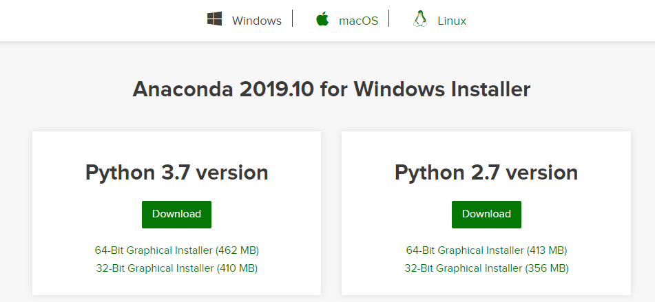
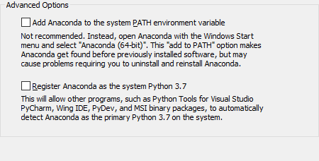
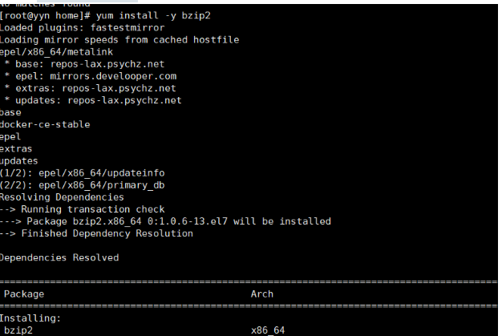
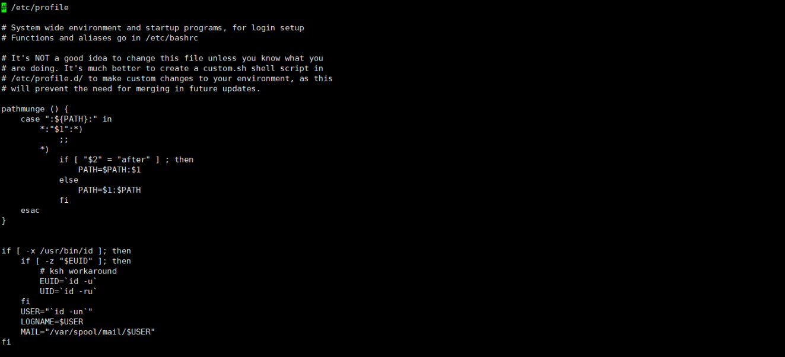
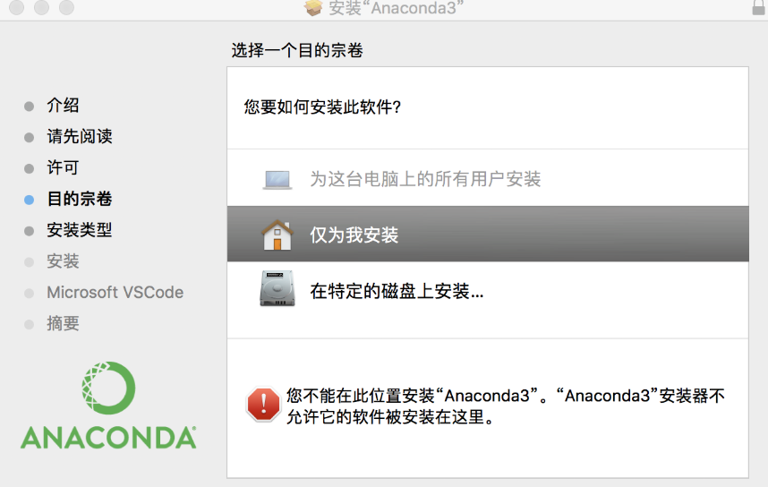
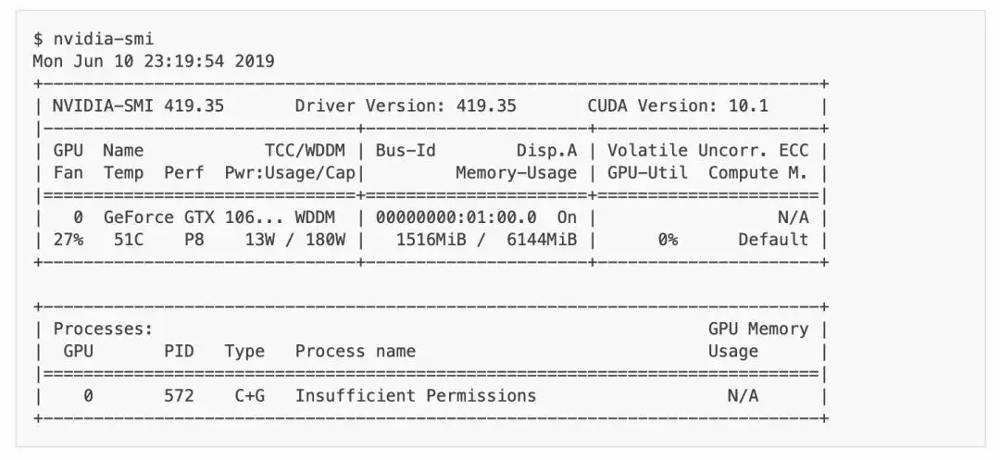
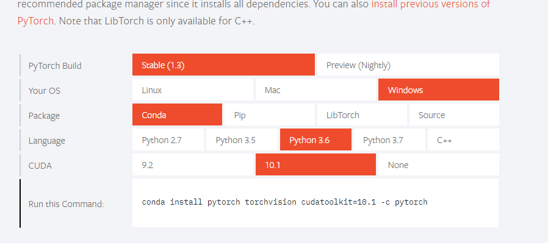
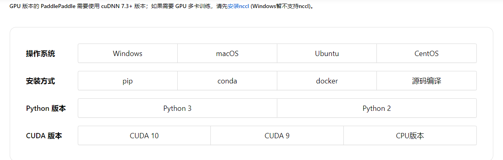

# 基础环境安装

## Anaconda简介

Anaconda是一个方便的python包管理和环境管理软件，一般用来配置不同的项目环境。
 我们常常会遇到这样的情况，正在做的项目A和项目B分别基于python2和python3，而第电脑只能安装一个环境，这个时候Anaconda就派上了用场，它可以创建多个互不干扰的环境，分别运行不同版本的软件包，以达到兼容的目的。
 Anaconda通过管理工具包、开发环境、Python版本，大大简化了你的工作流程。不仅可以方便地安装、更新、卸载工具包，而且安装时能自动安装相应的依赖包，同时还能使用不同的虚拟环境隔离不同要求的项目。

## anaconda的安装
> 前往[官网](https://www.anaconda.com/distribution/#windows),下载对应对应系统的安装包.


### 1. Win安装

运行下载好的安装包.当安装如下图所示的步骤时,请将两个选项都**勾选上**.之后一直往后点击完成安装.

   

> 其中第一项指将Anaconda的默认环境设置添加到系统环境，也就是说如果你之前安装过python并添加到了环境，选了这一项之后原来的python会被覆盖掉，默认使用Anaconda的默认环境。  
>
> 第二项指设置Anaconda的默认环境为python3.7(当前最新版为3.7).安装完成后Anaconda会创建一个叫base的默认环境，如果你不切换到其他指定环境，就会一直在默认环境运行。

打开`cmd`输入`python`测试时候安装成功.

### 2. Linux安装

 使用`sudo`语句运行:

   ```shell
   sudo bash Anaconda.sh
   ```

   > **注:如果无法运行,先使用`sudo chmod +x ./Anaconda.sh`更改权限,再运行.**


如果安装过程出现下述错误 **Ps：此错误由于缺失环境导致，不一定发生** .请输入`yum install -y bzip2`来安装环境.



**配置环境变量**

打开配置文件` sudo vi /etc/profile `, 输入密码后进入文件编辑. 输入上述命令后再输入`i`，会看到如下标识： 



在英文模式下键入`i`,在文件末尾输入:

```shell
#Anaconda
export PATH=$PATH:/root/anaconda3/bin
```

> `/root/anaconda3/`是你安装时输入的安装路径

最后,按下**ESC**键，输入`:wq`,然后回车,即可保存退出.

之后输入`source /etc/profile`重新载入配置文件.

打开终端(Terminal)，输入`python3` ,查看是否安装成功.

### 3. Mac



如果在终端输入`conda` 无法识别这个命令。

检查环境变量：

```shell
 sudo vi ~/.bash_profile
```

如果环境变量中没有conda那么要手动添加

```shell
export PATH="/Users/anaconda3/bin:$PATH"
```

> （这里要填写自己的路径）

刷新环境变量：

```shell
 source ~/.bash_profile
```

再查看 `conda list`就可以了 

## 常用操作命令

#### 一、环境操作

1.查看环境管理的全部命令帮助：

`conda env -h`

2.查看当前系统下的环境：

`conda info -e`

3.创建环境：

`conda create env_name `

 (env_name)是环境名称

创建指定python版本的环境：

`conda create env_name python=3.6 `

 (3.6为python的版本，根据自己的需要更改)

创建包含某些包的环境：

`conda create env_name numpy scipy`

创建指定python版本下包含某些包的环境： 

`conda create env_name python=3.6  numpy scipy`

 

激活（进入）某个环境：

新的开发环境会被默认安装在conda目录下envs文件目录下,你可以指定一个其他的路径；

如果没有指定安装python的版本，conda会安装最初安装conda时所装的那个版本的python。

windows:

`activate env_name`

linux:

`conda activate env_name`

mac:

`source activate env_name`

退出某个环境：

`deactivate env_name`

复制某个环境：

`conda create new_env_name old_env_name`

删除某个环境：

`conda remove env_name`

### 二、包管理

查看已安装的包：

`conda list`

查看指定环境下的包：

`conda list -n xxx`

查找包：

`conda search xxx`

更新包：

`conda update xxx`

安装包：

`conda install xxx`

`pip install xxx`

指定的安装环境：

`conda install -n env_name xxx`

 

安装anaconda发行版中所有的包:

`conda install anaconda`

卸载包：

`conda remove xxx`

### 三、管理conda

检查conda版本：

`conda --version`

升级当前版本的conda：

`conda update conda`


## 四、更换镜像

### Pip

a）Linux下，修改 ~/.pip/pip.conf (没有就创建一个文件夹及文件。文件夹要加“.”，表示是隐藏文件夹)
内容如下：

```[global]
index-url = https://pypi.tuna.tsinghua.edu.cn/simple
[install]
trusted-host = https://pypi.tuna.tsinghua.edu.cn
```

(b) windows下，直接在user目录中创建一个pip目录，如：C:\Users\xx\pip，然后新建文件pip.ini，即 %HOMEPATH%\pip\pip.ini，在pip.ini文件中输入以下内容（以豆瓣镜像为例）：
```
[global]
index-url = http://pypi.douban.com/simple
[install]
trusted-host = pypi.douban.com
```
### Conda

清华源： https://mirror.tuna.tsinghua.edu.cn/help/anaconda/ 

或者使用命令：

```shell
#添加清华的源
conda config --add channels https://mirrors.tuna.tsinghua.edu.cn/anaconda/pkgs/free/
 
# 设置搜索时显示通道地址
conda config --set show_channel_urls yes
```


## 五、安装TensorFlow

使用 Python 包管理器 pip 安装 TensorFlow。在命令行下输入以下命令：

```shell
pip install tensorflow==2.0.0   # TensorFlow CPU 版本
```

或

```shell
pip install tensorflow-gpu  # TensorFlow GPU 版本,需要具有 NVIDIA 显卡及正确安装驱动程序，详见下文
```

等待片刻即安装完毕。

也可以使用 `conda install tensorflow` 或者 `conda install tensorflow-gpu` 来安装 TensorFlow，不过 conda 源的版本往往更新较慢，难以第一时间获得最新的 TensorFlow 版本；

在 Windows 下，需要打开开始菜单中的 “Anaconda Prompt” 进入 Anaconda 的命令行环境；

在国内环境下，推荐使用 国内的 pypi 镜像 和 Anaconda 镜像 ，将显著提升 pip 和 conda 的下载速度；

注：清华大学的 pypi 镜像 链接

https://mirrors.tuna.tsinghua.edu.cn/help/pypi/

清华大学的 Anaconda 镜像 链接

https://mirrors.tuna.tsinghua.edu.cn/help/anaconda/

**GPU 版本 TensorFlow 安装指南**

GPU 版本的 TensorFlow 可以利用 NVIDIA GPU 强大的计算加速能力，使 TensorFlow 的运行更为高效，尤其是可以成倍提升模型训练的速度。

在安装 GPU 版本的 TensorFlow 前，你需要具有一块不太旧的 NVIDIA 显卡，以及正确安装 NVIDIA 显卡驱动程序、CUDA Toolkit 和 cnDNN。

**GPU 硬件的准备**

TensorFlow 对 NVIDIA 显卡的支持较为完备。对于 NVIDIA 显卡，要求其 CUDA Compute Capability 须不低于3.0，可以到 NVIDIA的官方网站 查询自己所用显卡的CUDA Compute Capability。目前，AMD 的显卡也开始对 TensorFlow 提供支持，可访问 这篇博客文章[查看详情](https://medium.com/tensorflow/amd-rocm-gpu-support-for-tensorflow-33c78cc6a6cf)。

注：NVIDIA的官方网站 链接

https://developer.nvidia.com/cuda-gpus/

**NVIDIA驱动程序的安装**

**Windows**

Windows 环境中，如果系统具有 NVIDIA 显卡，则往往已经自动安装了 NVIDIA 显卡驱动程序。如未安装，直接访问 NVIDIA 官方网站 下载并安装对应型号的最新公版驱动程序即可。

注：NVIDIA 官方网站 链接

https://www.nvidia.com/Download/index.aspx?lang=en-us

**Linux**

在服务器版Linux系统下，同样访问 NVIDIA官方网站 下载驱动程序（为 `.run` 文件），并使用`sudo bash DRIVER_FILE_NAME.run` 命令安装驱动即可。在安装之前，可能需要使用 `sudo apt-get install build-essential` 安装合适的编译环境。

在具有图形界面的桌面版Linux系统上，NVIDIA 显卡驱动程序需要一些额外的配置，否则会出现无法登录等各种错误。如果需要在 Linux 下手动安装 NVIDIA 驱动，注意在安装前进行以下步骤（以 Ubuntu 为例）：

- 禁用系统自带的开源显卡驱动Nouveau（在`/etc/modprobe.d/blacklist.conf`文件中添加一行`blacklist nouveau` ，使用`sudo update-initramfs -u`更新内核，并重启）
- 禁用主板的 Secure Boot 功能
- 停用桌面环境 (如`sudo service lightdm stop`)
- 删除原有 NVIDIA 驱动程序 (如`sudo apt-get purge nvidia*`) 

*小技巧*

对于桌面版Ubuntu系统，有一个很简易的NVIDIA驱动安装方法：在系统设置（System Setting）里面选软件与更新（Software & Updates），然后点选Additional Drivers里面的“Using NVIDIA binary driver”选项并点选右下角的“Apply Changes”即可，系统即会自动安装NVIDIA驱动，但是通过这种安装方式安装的NVIDIA驱动往往版本较旧。

NVIDIA 驱动程序安装完成后，可在命令行下使用`nvidia-smi`命令检查是否安装成功，若成功则会打印出当前系统安装的 NVIDIA 驱动信息，形式如下：



*提示*

命令`nvidia-smi`可以查看机器上现有的GPU及使用情况。（在 Windows 下，将`C:\Program Files\NVIDIA Corporation\NVSMI`加入 Path 环境变量中即可，或 Windows 10 下可使用任务管理器的“性能”标签查看显卡信息）

更详细的 GPU 环境配置指导可以参考 2篇博客文章 。

*注：参考博客文章1 链接*

https://www.linkedin.com/pulse/installing-nvidia-cuda-80-ubuntu-1604-linux-gpu-new-victor/

*参考博客文章2 链接*

https://blog.csdn.net/wf19930209/article/details/81877822

**CUDA Toolkit 和 cnDNN 的安装**

在Anaconda环境下，推荐使用：

`conda install cudatoolkit=X.X`

`conda install cudnn=X.X.X`

安装 CUDA Toolkit 和 cnDNN，其中 X.X 和 X.X.X 分别为需要安装的 CUDA Toolkit 和 cuDNN 版本号，必须严格按照 TensorFlow 官方网站所说明的版本安装（对于 TensorFlow 2.0 beta1，可以安装版本为 10.0 的 CUDA Toolkit 和版本为 7.6.0 的 cuDNN）。在安装前，可使用`conda search cudatoolkit`和`conda search cudnn`搜索 conda 源中可用的版本号。


当然，也可以按照 TensorFlow 官方网站上的说明 手动下载 CUDA Toolkit 和 cuDNN 并安装，不过过程会稍繁琐。


使用 conda 包管理器安装 GPU 版本的 TensorFlow 时，会自动安装对应版本的 CUDA Toolkit 和 cuDNN。conda 源的更新较慢，如果对版本不太介意，推荐直接使用`conda install tensorflow-gpu`进行安装。

注：TensorFlow 官方网站上的说明 链接

https://www.tensorflow.org/install/gpu


**第一个程序**

安装完毕后，我们来编写一个简单的程序来验证安装。

在命令行下输入`conda activate tensorflow`进入之前建立的安装有 TensorFlow 的 Conda 虚拟环境，再输入`python`进入 Python 环境，逐行输入以下代码：

```python
import tensorflow as tf
A = tf.constant([[1, 2], [3, 4]])
B = tf.constant([[5, 6], [7, 8]])
C = tf.matmul(A, B)
print(C)
```

如果能够最终输出:

```shell
tf.Tensor(
[[19 22]
[43 50]], shape=(2, 2), dtype=int32)
```

说明 TensorFlow 已安装成功。运行途中可能会输出一些 TensorFlow 的提示信息，属于正常现象。

**IDE 设置**

对于机器学习的研究者和从业者，建议使用 PyCharm 作为 Python 开发的 IDE。

注：PyCharm 链接

http://www.jetbrains.com/pycharm/

在新建项目时，你需要选定项目的 Python Interpreter，也就是用怎样的 Python 环境来运行你的项目。在安装部分，你所建立的每个 Conda 虚拟环境其实都有一个自己独立的 Python Interpreter，你只需要将它们添加进来即可。选择“Add”，并在接下来的窗口选择“Existing Environment”，在 Interpreter 处选择`Anaconda安装目录/envs/所需要添加的Conda环境名字/python.exe`（Linux下无`.exe`后缀）并点击“OK”即可。如果选中了“Make available to all projects”，则在所有项目中都可以选择该 Python Interpreter。注意，在 Windows 下 Anaconda 的默认安装目录比较特殊，一般为 `C:\Users\用户名\Anaconda3\`，即当前 Windows 用户的用户目录下。


对于 TensorFlow 开发而言，PyCharm 的 Professonal 版本非常有用的一个特性是 远程调试 （Remote Debugging）。当你编写程序的终端机性能有限，但又有一台可远程ssh访问的高性能计算机（一般具有高性能 GPU）时，远程调试功能可以让你在终端机编写程序的同时，在远程计算机上调试和运行程序（尤其是训练模型）。你在终端机上对代码和数据的修改可以自动同步到远程机，在实际使用的过程中如同在远程机上编写程序一般，与串流游戏有异曲同工之妙。


不过远程调试对网络的稳定性要求高，如果需要长时间训练模型，建议登录远程机终端直接训练模型（Linux 下可以结合[`nohup`命令](https://www.ibm.com/developerworks/cn/linux/l-cn-nohup/) ，让进程在后端运行，不受终端退出的影响）。远程调试功能的具体配置步骤见 PyCharm 文档 。

*小技巧*

如果你是学生并有 .edu 结尾的邮箱(或学生证)的话，可以在 [这里](http://www.jetbrains.com/student/) 申请 PyCharm 的免费 Professional 版本授权。

对于 TensorFlow 及深度学习的业余爱好者或者初学者， [Visual Studio Code](https://code.visualstudio.com/)或者一些在线的交互式 Python 环境（比如免费的 [Google Colab](https://colab.research.google.com/) ）也是不错的选择。Colab 的使用方式可[参考](https://tf.wiki/zh/appendix/cloud.html#colab) 。


**TensorFlow所需的硬件配置**

对于学习而言，TensorFlow 的硬件门槛并不高。甚至，借助免费或灵活的云端计算资源，只要你有一台能上网的电脑，就能够熟练掌握 TensorFlow！

在很多人的刻板印象中，TensorFlow 乃至深度学习是一件非常“吃硬件”的事情，以至于一接触 TensorFlow，第一件事情可能就是想如何升级自己的电脑硬件。不过，TensorFlow 所需的硬件配置很大程度是视任务和使用环境而定的：

- 对于 TensorFlow 初学者，无需硬件升级也可以很好地学习和掌握 TensorFlow。本手册中的大部分教学示例，大部分当前主流的个人电脑（即使没有 GPU）均可胜任，无需添置其他硬件设备。如果自己的个人电脑难以胜任，可以考虑在云端（例如免费的 Colab ）进行模型训练。
- 对于参加数据科学竞赛（比如 Kaggle）或者经常在本机进行训练的个人爱好者或开发者，一块高性能的 NVIDIA GPU 往往是必要的。CUDA 核心数和显存大小是决定显卡机器学习性能的两个关键参数，前者决定训练速度，后者决定可以训练多大的模型以及训练时的最大 Batch Size，对于较大规模的训练而言尤其敏感。
- 对于前沿的机器学习研究（尤其是计算机视觉和自然语言处理领域），多 GPU 并行训练是标准配置。为了快速迭代实验结果以及训练更大规模的模型以提升性能，4 卡、8 卡或更高的 GPU 数量是常态。


## 六、其他库安装

> PyTorch,PaddlePaddle安装与TensorFlow类似,不再过多介绍.GPU版本的安装可以根据官方文档要求驱动的版本使用TensorFlow中介绍的方式安装.

1. PyTorch

   进入[PyTorch官网]( https://pytorch.org/ ),选择合适的安装方式,运行命令安装即可.

   

   

2. PaddlePaddle

   进入[PaddlePaddle官网]( https://www.paddlepaddle.org.cn/install/quick ),选择合适的安装方式,运行命令安装即可.



3. 其他库

   ```shell
   pip install numpy pandas matplotlib seaborn sklearn xgboost lightgbm 
   ```


*参考:https://mp.weixin.qq.com/s/7rNXFEC5HYe91RJ0-9CKdQ*