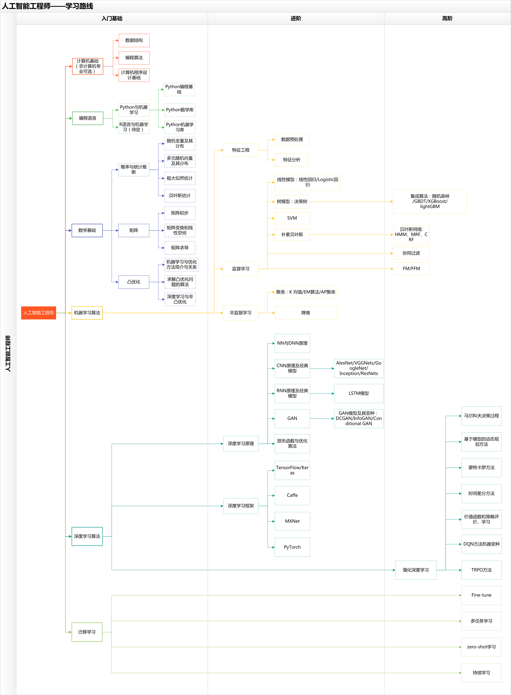
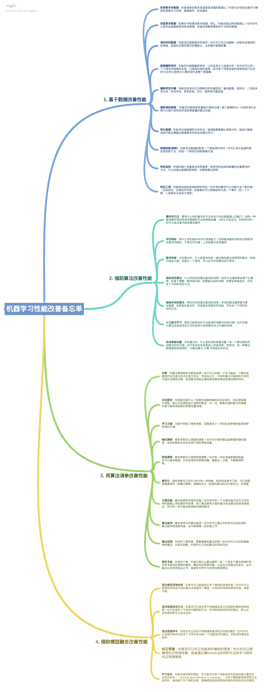

# BOOK

---
# 机器学习

- [2012.李航.统计学习方法.pdf](2012.李航.统计学习方法.pdf)
- [机器学习_周志华.pdf](机器学习_周志华.pdf)
> 以上两本书入门级别的，这两本各有不同，可以相互借鉴，建议都可以一下。

# 深度学习
- [deeplearning深度学习笔记v5.1.pdf](deeplearning深度学习笔记v5.1.pdf)
> 这本书是一位博士协同其他AI爱好者编写的吴恩达教授《DeepLearning》课程的学习笔记，如果看过这门课程强烈推荐此书，不看这门课程，也可以推荐观看。

- [深度学习(Deep Learning) Yoshua Bengio & Ian GoodFellow中文版.pdf](深度学习(Deep Learning).pdf)
> 此书为几个业界大佬所写，属于进阶型书籍（我自认为），建议大家后期观看。

- [机器学习训练秘籍（完整中文版）.pdf](机器学习训练秘籍（完整中文版）.pdf)
> 此书如书名所写，是一本用于训练时候，参数调整，模型优化时，参考使用的。

- 某大佬编写的模型优化思维导图

# 深度学习框架

- [TensorFlow](https://tensorflow.google.cn)
> Google开发的深度学习框架

- [Keras](https://keras.io/)
- [Keras中文文档](https://keras.io/zh)
> Keras是高级神经网络 API， 可以使用TensorFlow, CNTK, 或者 Theano作为其后端。现在TensorFlow整合了Keras，通过tf.keras即可使用。在即将发布的TensorFlow2.0中，tf.keras将于TensorFlow深度整合，推荐使用。

- [PyTorch](https://pytorch.org)
- [PyTorch中文文档](https://pytorch.apachecn.org/#/)
> Facebook, NVIDIA, Twitter等开发

# 传统机器学习框架
- [sklearn](https://scikit-learn.org/stable/index.html)
- [sklearn中文文档](http://sklearn.apachecn.org/)
> 封装了常见的传统机器学习算法

- [XGBoost](https://github.com/dmlc/xgboost)
- [XGBoost中文文档](http://xgboost.apachecn.org/#/)
> 陈天琦大佬所编写的基于提升树的扩展算法，[Paper](https://arxiv.org/abs/1603.02754)，Kaggle比赛的利器之一

- [LightGBM](https://github.com/Microsoft/LightGBM)
- [LightGBM中文文档](http://lightgbm.apachecn.org/#/)
> 微软编写，也是基于提升树，不过这个速度更快，内存占用率低。与XGBoost起鼓相当，甚至已经超过XGBoost了，也是Kaggle比赛的一大利器。

- OpenCV

  - [OpenCV-Python-Toturial-中文版.pdf](OpenCV-Python-Toturial-中文版.pdf)

  - [OpenCV官方教程中文版ForPython.pdf](OpenCV官方教程中文版ForPython.pdf)

  - [OpenCv官方教程中文版.pdf](OpenCv官方教程中文版.pdf)

  - [OpenCV实例精解-普拉蒂克-乔希.pdf](OpenCV实例精解-普拉蒂克-乔希.pdf)

    

    

